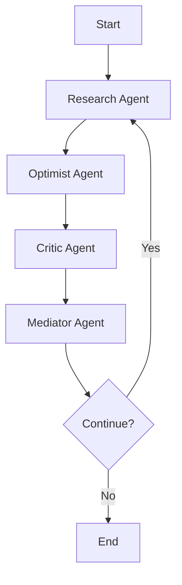

# 🎭 Multi-Agent Debate System

<div align="center">

**An intelligent debate orchestration system powered by LangChain & LangGraph**

[](https://www.python.org/downloads/)
[](https://github.com/langchain-ai/langchain)
[](https://github.com/langchain-ai/langgraph)
[](LICENSE)

</div>

---

## 📖 Overview

The **Multi-Agent Debate System** is a sophisticated AI-powered application that orchestrates structured debates between specialized agents. Using LangChain and LangGraph, it enables multiple AI agents to collaborate, challenge, and synthesize viewpoints on complex topics, ultimately reaching well-reasoned conclusions.

### 🤖 Meet the Agents

- **🔍 Research Agent**: Neutral fact-gatherer that conducts web searches and provides objective information
- **✨ Optimist Agent**: Advocates for positive perspectives and benefits of proposals
- **⚠️ Critic Agent**: Identifies risks, challenges, and potential downsides
- **⚖️ Mediator Agent**: Synthesizes arguments, manages debate flow, and determines consensus

---

## ✨ Key Features

- **🔄 Multi-Round Debates**: Configurable debate rounds with dynamic agent interactions
- **🌐 Web-Powered Research**: Real-time fact gathering using Tavily search API
- **🧠 Persistent Memory**: SQLite-based checkpointing for conversation history
- **📊 Structured State Management**: Type-safe state schema shared across all agents
- **🎯 Intelligent Routing**: Conditional logic determines debate progression
- **📝 Comprehensive Logging**: Track debate progress with detailed logging
- **🔧 Extensible Architecture**: Easy to add new agents, tools, or debate formats
- **🎨 Beautiful Output**: Formatted debate summaries and transcripts

---

## 🏗️ Architecture

```
┌─────────────────────────────────────────────────────────┐
│                    Debate Orchestrator                  │
│                      (LangGraph)                        │
└──────────────┬──────────────────────────────────────────┘
               │
               ├──► 🔍 Research Agent
               │    └─► Web Search (Tavily)
               │
               ├──► ✨ Optimist Agent
               │    └─► Pro Arguments
               │
               ├──► ⚠️ Critic Agent
               │    └─► Counterarguments
               │
               └──► ⚖️ Mediator Agent
                    ├─► Synthesize Consensus
                    └─► Route: Continue or End?
```

The system uses a **directed graph workflow** where:
1. Research agent gathers facts
2. Optimist and Critic present opposing views
3. Mediator synthesizes and decides whether to continue
4. Process repeats until consensus or max rounds reached

---

## 🚀 Quick Start

### Prerequisites

- Python 3.11 or higher
- OpenAI API key
- Tavily API key (for web search)

### Installation

1. **Clone the repository**
```bash
git clone https://github.com/yourusername/multi-agent-debate-system.git
cd multi-agent-debate-system
```

2. **Create and activate virtual environment**
```bash
# Windows
python -m venv venv
.\venv\Scripts\activate

# Linux/Mac
python3 -m venv venv
source venv/bin/activate
```

3. **Install dependencies**
```bash
pip install -r requirements.txt
```

4. **Set up environment variables**
```bash
# Copy the example environment file
cp env.example .env

# Edit .env and add your API keys
# OPENAI_API_KEY=your-openai-api-key-here
# TAVILY_API_KEY=your-tavily-api-key-here
```

5. **Run your first debate!**
```bash
python scripts/run_debate.py --topic "Should AI be regulated by government?" --rounds 3
```

---

## 💡 Usage Examples

### Basic Debate

```bash
python scripts/run_debate.py --topic "Is remote work better than office work?" --rounds 2
```

### Extended Debate (More Rounds)

```bash
python scripts/run_debate.py --topic "Should we colonize Mars?" --rounds 5
```

### Simple Debate Runner (Simplified Interface)

```bash
python scripts/run_debate_simple.py
```

### Programmatic Usage

```python
from src.graph.debate_graph import create_debate_graph

# Create debate graph
graph = create_debate_graph()

# Define initial state
initial_state = {
    "messages": [],
    "topic": "Should genetic engineering be allowed in humans?",
    "research_facts": "",
    "optimist_arguments": [],
    "critic_arguments": [],
    "consensus": "",
    "debate_round": 1,
    "max_rounds": 3,
    "is_complete": False,
}

# Run debate
config = {"configurable": {"thread_id": "my-debate-001"}}
for update in graph.stream(initial_state, config):
    print(update)
```

---

## ⚙️ Configuration

Edit your `.env` file to customize behavior:

```ini
# API Keys
OPENAI_API_KEY=your-openai-api-key-here
TAVILY_API_KEY=your-tavily-api-key-here

# Model Configuration
MODEL_NAME=gpt-4                    # or gpt-4-turbo, gpt-3.5-turbo
MODEL_TEMPERATURE=0.7               # 0.0 = deterministic, 1.0 = creative

# Debate Settings
MAX_DEBATE_ROUNDS=3                 # Default maximum rounds
LOG_LEVEL=INFO                      # DEBUG, INFO, WARNING, ERROR
```

### Model Options

- `gpt-4` - Most capable, higher cost
- `gpt-4-turbo` - Fast and capable
- `gpt-3.5-turbo` - Cost-effective for testing
- `gpt-4o` - Optimized for complex reasoning

---

## 📁 Project Structure

```
multi-agent-debate-system/
├── src/
│   ├── agents/              # Agent implementations
│   │   ├── base_agent.py    # Base agent class
│   │   ├── research_agent.py
│   │   ├── optimist_agent.py
│   │   ├── critic_agent.py
│   │   └── mediator_agent.py
│   ├── graph/               # LangGraph orchestration
│   │   ├── debate_graph.py  # Main graph definition
│   │   ├── state.py         # State schema
│   │   ├── nodes.py         # Graph nodes
│   │   └── edges.py         # Conditional edges
│   ├── prompts/             # Agent prompts
│   │   ├── research_prompt.py
│   │   ├── optimist_prompt.py
│   │   ├── critic_prompt.py
│   │   └── mediator_prompt.py
│   ├── tools/               # Custom tools
│   │   ├── web_search.py    # Tavily integration
│   │   └── custom_tools.py
│   ├── memory/              # Persistence layer
│   │   └── checkpointer.py  # SQLite checkpointer
│   ├── config/              # Configuration
│   │   └── settings.py
│   └── utils/               # Utilities
│       ├── logger.py
│       ├── output_formatter.py
│       └── validators.py
├── scripts/                 # Entry points
│   ├── run_debate.py        # Main debate runner
│   ├── run_debate_simple.py # Simplified interface
│   └── setup_db.py          # Database setup
├── tests/                   # Test suite
│   ├── test_agents.py
│   ├── test_graph.py
│   └── test_integration.py
├── docs/                    # Documentation
│   ├── architecture.md
│   ├── agent_design.md
│   └── usage_guide.md
├── data/                    # Data storage
│   ├── debates/             # Debate transcripts
│   └── memory/              # SQLite database
├── notebooks/               # Jupyter notebooks
├── requirements.txt         # Dependencies
├── env.example             # Environment template
└── README.md               # This file
```

---

## 🔧 How It Works

### 1. **State Management**

The debate system uses a typed state schema (`DebateState`) that all agents can access:

```python
class DebateState(TypedDict):
    messages: List[Any]              # Conversation history
    topic: str                       # Debate topic
    research_facts: str              # Gathered facts
    optimist_arguments: List[str]    # Pro arguments
    critic_arguments: List[str]      # Con arguments
    consensus: str                   # Final consensus
    debate_round: int                # Current round
    max_rounds: int                  # Maximum rounds
    is_complete: bool                # Completion flag
```

### 2. **Graph Execution Flow**



### 3. **Agent Roles**

Each agent has a specific prompt template and role:

- **Research**: Gathers objective facts using web search
- **Optimist**: Builds arguments supporting the proposition
- **Critic**: Challenges assumptions and identifies risks
- **Mediator**: Evaluates arguments and synthesizes consensus

### 4. **Memory & Persistence**

Uses LangGraph's SQLite checkpointer to maintain conversation history across sessions.

---

## 🤝 Contributing

Contributions are welcome! Here's how you can help:

1. **Fork the repository**
2. **Create a feature branch** (`git checkout -b feature/amazing-feature`)
3. **Commit your changes** (`git commit -m 'Add amazing feature'`)
4. **Push to the branch** (`git push origin feature/amazing-feature`)
5. **Open a Pull Request**

### Ideas for Contributions

- 🎯 New agent types (Devil's Advocate, Fact Checker, etc.)
- 🔧 Additional tools (database search, document analysis)
- 📊 Visualization of debate flow
- 🌍 Multi-language support
- 📱 Web interface or API
- 📈 Analytics and metrics

---

## 📚 Documentation

For more detailed information:

- [Architecture Overview](docs/architecture.md) - Deep dive into system design
- [Agent Design Decisions](docs/agent_design.md) - Agent roles and responsibilities
- [Usage Guide](docs/usage_guide.md) - Advanced usage patterns

---

## 🙏 Acknowledgments

- [LangChain](https://github.com/langchain-ai/langchain) - Framework for LLM applications
- [LangGraph](https://github.com/langchain-ai/langgraph) - Graph orchestration for agents
- [Tavily](https://tavily.com/) - AI-powered search API
- [OpenAI](https://openai.com/) - GPT models

---

## 📬 Contact

Questions? Suggestions? Open an issue or reach out!

---


